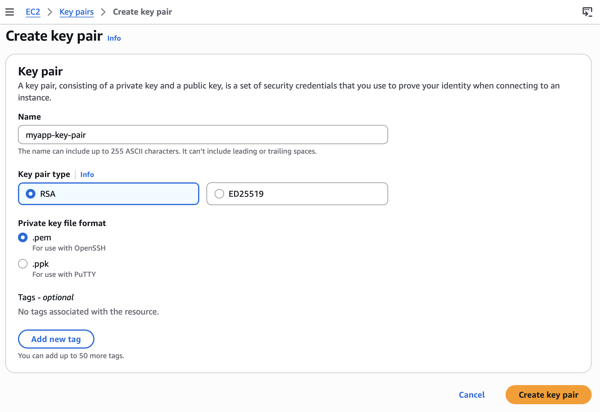
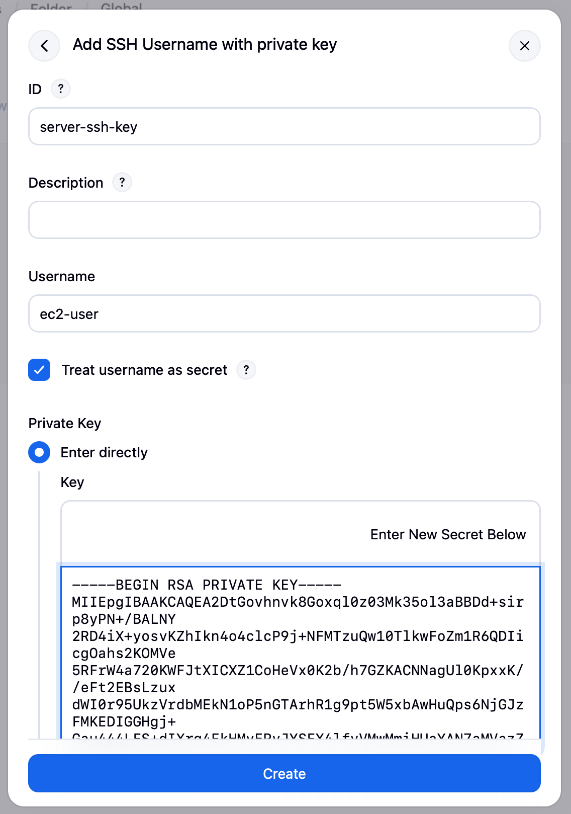
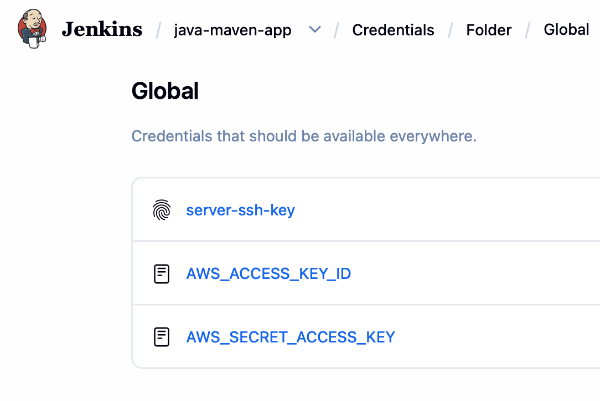
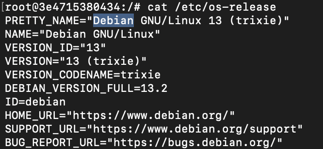
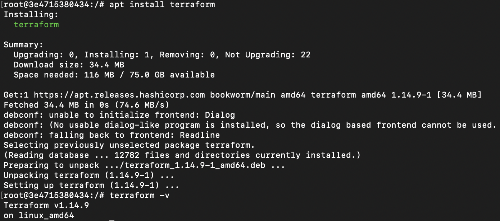

# Module 12 - Infrastructure as Code with Terraform

This repository contains a demo project created as part of my **DevOps studies** in the [TechWorld with Nana – DevOps Bootcamp](https://www.techworld-with-nana.com/devops-bootcamp).

**Demo Project:** Complete CI/CD with Terraform

**Technologies used:** Terraform, Jenkins, Docker, AWS, Git, Java, Maven, Linux, Docker Hub

**Project Description:**

Integrate provisioning stage into complete CI/CD Pipeline to automate provisioning server instead of deploying to an existing server.

- Create SSH Key Pair
- Install Terraform inside Jenkins container
- Add Terraform configuration to application’s git repository
- Adjust Jenkinsfile to add “provision” step to the CI/CD pipeline that provisions EC2 instance
- So the complete CI/CD project we build has the following configuration:
  - a.CI step: Build artifact for Java Maven application
  - b.CI step: Build and push Docker image to Docker Hub
  - c.CD step: Automatically provision EC2 instance using TF
  - d.CD step: Deploy new application version on the provisioned EC2 instance with Docker Compose

---

### Prerequisites

Before starting, complete the following setup modules:

- **Jenkins on DigitalOcean:** [jenkins-module-8.1](https://github.com/explicit-logic/jenkins-module-8.1)
- **Build Tools (Maven, Node):** [jenkins-module-8.2](https://github.com/explicit-logic/jenkins-module-8.2?tab=readme-ov-file#install-build-tools-maven-node-in-jenkins)

In addition, install the following Jenkins plugin:

- **SSH Agent** — required to forward SSH credentials from Jenkins to the provisioned EC2 instance during the deploy stage.

---

### Configure a Multibranch Pipeline in Jenkins

A multibranch pipeline automatically discovers branches in the repository and runs the `Jenkinsfile` from each one, so feature branches get their own isolated builds.

1. Go to **Dashboard** → **New Item**
2. Name it `java-maven-app`, select **Multibranch Pipeline**, and click **OK**

**Branch Sources**

Click **Add source** → **GitHub** and fill in:

| Field                | Value                                                        |
| -------------------- | ------------------------------------------------------------ |
| Credentials          | `github`                                                     |
| Repository HTTPS URL | `https://github.com/explicit-logic/terraform-module-12.5`    |

Click **Validate** to confirm that Jenkins can reach the repository.

**Behaviors** — click **Add** and enable:

- `Discover branches`

**Build Configuration**

- Script Path: `Jenkinsfile`

3. Click **Save**. Jenkins scans the repository and creates a job for every branch that contains a `Jenkinsfile`.

---

### Create an SSH Key Pair

This key pair is used by Jenkins to connect to the EC2 instance that Terraform will provision.

In the AWS Console, go to **EC2** → **Key pairs** → **Create key pair**:

- **Name:** `myapp-key-pair`
- **Key pair type:** `RSA`
- **Private key file format:** `.pem`

The private key (`myapp-key-pair.pem`) is downloaded automatically — keep it safe, AWS does not let you download it again.



Restrict access to the private key so that SSH clients will accept it:

```sh
chmod 400 ~/Downloads/myapp-key-pair.pem
```

#### Store the SSH Key Pair in Jenkins

Go to `java-maven-app` → **Credentials** → **Global** → **Add Credentials** and fill in:

| Field       | Value                              |
| ----------- | ---------------------------------- |
| Kind        | `SSH Username with private key`    |
| ID          | `server-ssh-key`                   |
| Username    | `ec2-user`                         |
| Private Key | **Enter directly** — paste the contents of the `.pem` file |

Copy the key contents to the clipboard:

```sh
cat ~/Downloads/myapp-key-pair.pem
```



---

### Add AWS Credentials to Jenkins

Terraform needs AWS access keys to create resources on your behalf. Store them in Jenkins as **Secret text** credentials so they can be injected into the build environment without being exposed in the pipeline logs.

1. Go to `java-maven-app` → **Credentials** → **Global** → **Add Credentials**
2. Add two **Secret text** credentials using the access keys of an IAM user with the required permissions:

| ID                      | Secret                |
| ----------------------- | --------------------- |
| `AWS_ACCESS_KEY_ID`     | `<Access key>`        |
| `AWS_SECRET_ACCESS_KEY` | `<Secret access key>` |



---

### Install Terraform inside the Jenkins container

Terraform runs as part of the Jenkins pipeline, so the binary must be available inside the Jenkins container.

Connect to the Jenkins droplet:

```sh
ssh root@<DROPLET-IP>
```

Enter the Jenkins container as `root`:

```sh
docker ps
docker exec -it -u 0 <container_id> bash
```

Confirm the container's OS and version — the installation commands below assume a Debian-based image:

```sh
cat /etc/os-release
```



Install the tools required by the HashiCorp apt repository:

```sh
apt update
apt install -y wget gnupg lsb-release

# Verify installation
wget --version
gpg --version
```

Add the HashiCorp GPG key and apt repository, then install Terraform (see the [official instructions](https://developer.hashicorp.com/terraform/install) for alternative platforms):

```sh
wget -O - https://apt.releases.hashicorp.com/gpg | gpg --dearmor -o /usr/share/keyrings/hashicorp-archive-keyring.gpg
echo "deb [arch=$(dpkg --print-architecture) signed-by=/usr/share/keyrings/hashicorp-archive-keyring.gpg] https://apt.releases.hashicorp.com bookworm main" | tee /etc/apt/sources.list.d/hashicorp.list
apt update && apt install -y terraform

# Verify installation
terraform -v
```



---

### Add Terraform configuration to the application repository

Create a `terraform/` directory at the root of the application repository and add the following files:

- `main.tf` — VPC, subnet, security group, and EC2 instance definitions
- `variables.tf` — input variables with sensible defaults
- `entry-script.sh` — user-data script that installs Docker and Docker Compose on the EC2 instance at boot time

Refer to the [Docker Compose standalone installation docs](https://docs.docker.com/compose/install/standalone/) when writing `entry-script.sh`.

To restrict SSH access to your workstation only, set the `my_ip` variable in `variables.tf` to your current public IP:

```sh
curl https://ipinfo.io/ip
```

---

### Add a “provision server” stage to the Jenkinsfile

This stage runs `terraform init` and `terraform apply` from inside the pipeline, using the AWS credentials stored in Jenkins.

```groovy
stage("provision server") {
  environment {
    AWS_ACCESS_KEY_ID     = credentials('AWS_ACCESS_KEY_ID')
    AWS_SECRET_ACCESS_KEY = credentials('AWS_SECRET_ACCESS_KEY')
    TF_VAR_env_prefix     = 'test'
  }
  steps {
    script {
      dir('terraform') {
        sh "terraform init"
        sh "terraform apply --auto-approve"
      }
    }
  }
}
```

> Variables prefixed with `TF_VAR_` are picked up automatically by Terraform as input variables — here `TF_VAR_env_prefix` sets `var.env_prefix`.

See the full pipeline: [Jenkinsfile](./Jenkinsfile)

---

### Add the deploy stage to the Jenkinsfile

After Terraform finishes, read the EC2 public IP from the Terraform output and expose it as a pipeline variable. Add this at the end of the `provision server` stage:

```groovy
EC2_PUBLIC_IP = sh(
  script: "terraform output ec2_public_ip",
  returnStdout: true
).trim()
```

Then add the deploy stage, which copies the deployment scripts to the new instance and runs them over SSH:

```groovy
stage("deploy") {
  steps {
    script {
      echo "waiting for EC2 server to initialize"
      sleep(time: 90, unit: "SECONDS")

      echo "deploying docker image to EC2..."
      echo "${EC2_PUBLIC_IP}"

      def shellCmd   = "bash ./server-cmds.sh ${params.IMAGE_NAME}:${params.IMAGE_TAG}"
      def ec2Instance = "ec2-user@${EC2_PUBLIC_IP}"

      sshagent(['server-ssh-key']) {
        sh "scp -o StrictHostKeyChecking=no server-cmds.sh ${ec2Instance}:/home/ec2-user"
        sh "scp -o StrictHostKeyChecking=no docker-compose.yaml ${ec2Instance}:/home/ec2-user"
        sh "ssh -o StrictHostKeyChecking=no ${ec2Instance} ${shellCmd}"
      }
    }
  }
}
```

The 90-second sleep gives `entry-script.sh` time to finish installing Docker and Docker Compose before the deploy step tries to use them.

---

### Log in to Docker Hub to pull the image

Because our application image lives in a private Docker Hub repository, the EC2 instance must authenticate before `docker compose up` can pull it. Add the `docker` credentials to the stage environment — Jenkins automatically splits a **Username with password** credential into `DOCKER_CREDS_USR` and `DOCKER_CREDS_PSW`:

```groovy
environment {
  DOCKER_CREDS = credentials('docker')
}
```

Then pass the username and password through to the server script:

```groovy
def shellCmd = "bash ./server-cmds.sh ${params.IMAGE_NAME}:${params.IMAGE_TAG} ${DOCKER_CREDS_USR} ${DOCKER_CREDS_PSW}"
```

Inside `server-cmds.sh`, use these arguments to run `docker login` on the EC2 instance before pulling the image.

---

### Run the CI/CD pipeline

Trigger a build from Jenkins and wait for all stages to succeed. Once the deploy stage finishes, connect to the freshly provisioned EC2 instance:

```sh
ssh -i ~/Downloads/myapp-key-pair.pem ec2-user@<ec2_public_ip>
```

Verify that the application container is running:

```sh
docker ps
```

**Demo**


